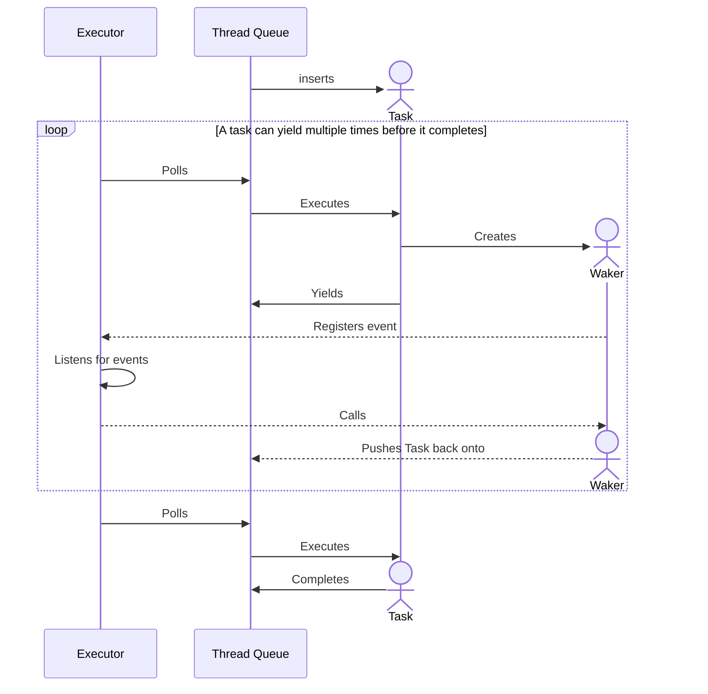

# Event callbacks for non-blocking tasks

A common pitfall of asynchronous code is how to handle task wake-up in an efficient, non-blocking way. To solve this problem, we can use bulk event registration as a way to quickly check for task completion. Here is how this would work:

1. An **event loop** is created (for example as part of the executor) and is responsible for registering and checking new events.
2. When a task yields compute, it can *register interest* in a particular event by adding it to the event loop, along with an **event callback** to be executed when that event completes.
3. Events are checked in groups, for example using low-level os primitives such as `epoll`. This is a blocking operation inside of the *event loop.*
4. When events complete, the *event loop* is unblocked and is allowed to move forwards in its execution, handling all the events that have completed. This triggers the *event callbacks* associated to each event that has completed.

{: .note }
> `events` can be changes in the IO state, availability of another sub-task in a dependent task, updates to external services...

Using events in such a way allows us to efficiently handle `async` **wakers** without requiring a dedicated thread to check requirements for every yielding task: when a task yields compute, it registers interest in the event which is blocking it's compute and sets a call to it's *waker* as the event callback. That way, when the event completes, the associated *waker* can be called and the task will be added back to the thread pool.

---

## A typical Task lifecycle with event callbacks

*The following diagram shows a tasks being added to the tread queue, repeatedly polled, yieled and woken up to completion.*

