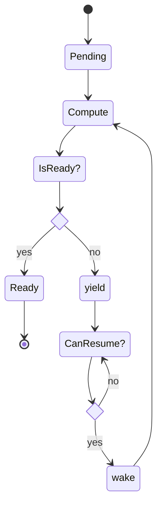

# The [`Future`](https://doc.rust-lang.org/std/future/trait.Future.html) trait

The `Future` trait is at the heart of `async` programming in Rust by providing a *common interface* for async functions to adhere to.

```rust
pub trait Future {
    type Output;

    // Required method
    fn poll(self: Pin<&mut Self>, cx: &mut Context<'_>) -> Poll<Self::Output>;
}
```
*Actual definition of the `Future` trait.*

---

## [`Poll`](https://doc.rust-lang.org/std/task/enum.Poll.html) and the Rust `async` state machine

The `poll` function allows a `Future` to make progress in it's computation or yield compute by representing it's progress so far as a [state machine](https://www.freecodecamp.org/news/state-machines-basics-of-computer-science-d42855debc66/). This is represented by the `Poll` enum:

```rust
pub enum Poll<T> {
    Ready(T),
    Pending,
}
```
*Actual definition of the `Poll` enum.*

A `Future` can be in two possible states:
- `Pending`: the future has not yet advanced to completion and has yielded compute. Its associated **task** will be added back to the thread pool when conditions are met for it to resume computation.
See the [waker executor model](#waker-model) for more details on how this works.
- `Ready`: the future has finished computing and can now return a result. This also marks the time when its associated **task** will be polled for the last time, being essentially removed from the thread pool and executor.

{: .warning }
> It is a `Future`'s own responsibility to ensure it can be awoken when progress can be made. There is no mechanism in place to do this automatically, so wakeup must be handled in the *implementation* of a `Future`.

## A typical `Future` lifecycle

*The following diagram displays the `Poll` state of a future, from being polled for the first time in a `Pending` state, to reaching completion in its `Ready` state.*



---

## Async [`Context`](https://doc.rust-lang.org/std/task/struct.Context.html) in `Future`

Currently a `Context` in Rust only contains a [`Waker`](https://doc.rust-lang.org/std/task/struct.Waker.html) which can be used to wake it's associated task. This works by notifying the executor to `poll` the task again, allowing the future to make progress in it's execution again.

A `Context` is passed to a `Future` whenever it is polled.
This instance or it's associated `Waker` should not be shared or stored as it is always possible for a task to *switch threads* as a result of [yielding compute](#yield-compute-model) or [work stealing](#work-stealing-model), making this information only *temporarily* valid.

---

## A simple `Future` implementation

*The following is an illustrative example of what a `Future` implementation might look like. It is designed to showcase the concepts discussed previously in a more practical way while still not bearing the complexity of an actual full implementation.*

```rust
/// A `Future` that will asynchronously wait until it is able to read 
/// a specific port.
struct IoReadingFuture {
    shared_state: Arc<Mutex<SharedState>>
}

#[derive(Default)]
struct SharedState {
    completed: bool,
    executor: Executor
}

/// Here we use an Executor with event callback for handling the wake-up
/// of non-blocking tasks.
struct Executor {
    registered_events: Vec<IoEvent>,
    // ...
}

/// An events consists of some identifying information as well as callback
/// to be run when that event occurrs. This callback is used to call a waker.
enum IoEvent {
    PortReadable(u32, impl FnOnce() -> ()),
    // ...
}

impl Future for IoReadingFuture {
    type Output = ();

    /// `poll` is responsible for trying to make progress in the `Future`'s
    /// execution as well as notifying the executor of the `Future`'s state.
    fn poll(self: Pin<&mut Self>, cx: &mut Context<'_>) -> Poll<Self::Output> {
        let mut shared_state = self.shared_state.lock().unwrap();
        if shared_state.completed {
            // Perform some computation here once port has become readable.
            // ...

            Poll::Ready()
        } else {
            // Register interest in a specific event so as to be able
            // to yield compute. Waker will be called once event
            // occurrs so the future can make progress in its execution.
            // In this case, we are waiting for a port to be readable.
            shared_state.executor.registered_events.push(
                Event::PortReadable(self.port, move || {
                    // remember, context might change since this future 
                    // could be called accross multiple threads and 
                    // different task queues, so we clone this each time
                    // in order to avoid a stale waker pointer.
                    cx.waker.clone().wake()
                }));

            // We could have more than one event registration throughout
            // the lifetime of this future (if it had more possible
            // states than completed == true && completed == false).

            // Yield compute until the waker is called once the registered
            // event occurrs.
            Poll::Pending
        }
    }
}
```
